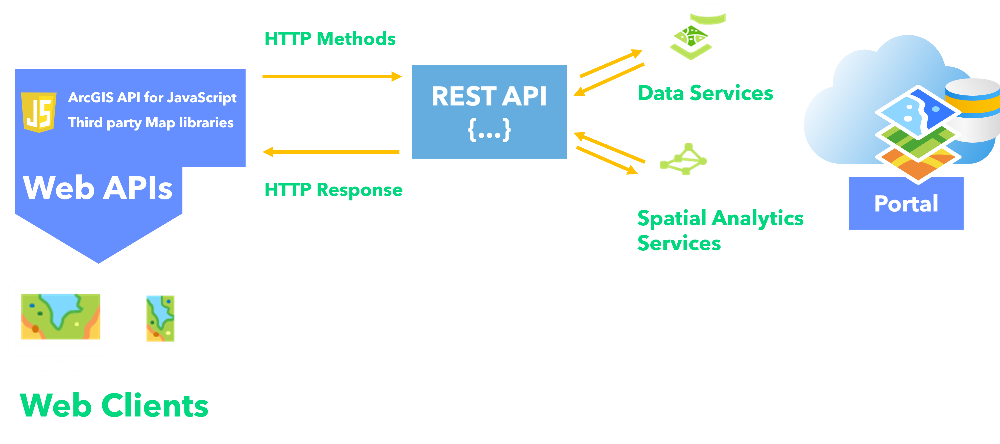
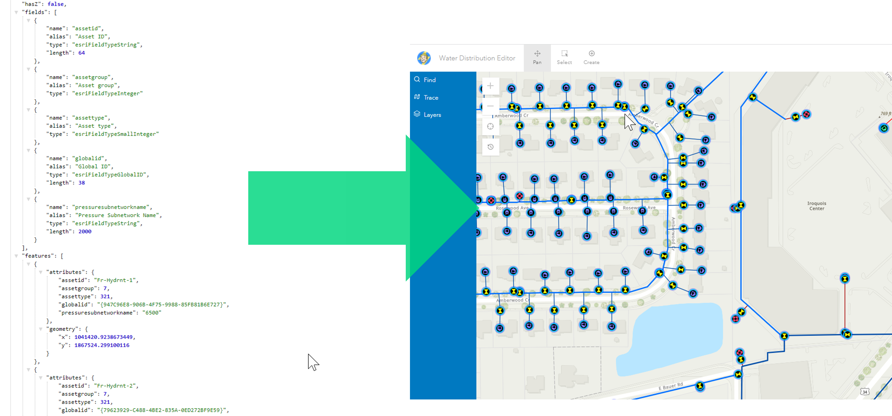

## Discovering what's available with ArcGIS Platform and JavaScript

[bit.ly/AC22DevJS](https://bit.ly/AC22DevJS)

<div class="name-title"> Jonny Dawe ⚡ Kristian Kaesinger  </div>

---

<!-- .slide: data-background-image="./assets/MainSlide.png"; .slide: data-background-size="cover" -->

## [ArcGIS is an API](https://developers.arcgis.com/rest/services-reference/enterprise/get-started-with-the-services-directory.htm)



---

<!-- .slide: data-background-image="./assets/MainSlide.png"; .slide: data-background-size="cover" -->



---

<!-- .slide: data-background-image="./assets/MainSlide.png"; .slide: data-background-size="cover" -->

## [ArcGIS Platform](https://www.esri.com/about/newsroom/arcnews/arcgis-platform-gives-developers-direct-access-to-location-services/)


---

<!-- .slide: data-background-image="./assets/DemoLinkSlide.png"; .slide: data-background-size="cover" -->

# [developers.arcgis.com](https://developers.arcgis.com/)

---

<!-- .slide: data-background-image="./assets/MainSlide.png"; .slide: data-background-size="cover" -->

# ArcGIS JavaScript API

#### Powerful visualisation, smart mapping and analytics capabilities <!-- .element: class="fragment" data-fragment-index="1" -->

#### Create interactive 2D and 3D user experiences <!-- .element: class="fragment" data-fragment-index="2" -->

#### Highly Tailored functionality work seamlessly with ArcGIS Services and Items <!-- .element: class="fragment" data-fragment-index="3" -->

#### Modular design (e.g ES modules and AMD) - only use what you need! <!-- .element: class="fragment" data-fragment-index="4" -->

---

<!-- .slide: data-background-image="./assets/MainSlide.png"; .slide: data-background-size="cover" -->

## [Simple JS Demo](https://github.com/Esri/cim-spec/blob/master/docs/v2/CIMSymbols.md#cimpointsymbol)

<div class="two-col">
  <div class="snippets full-height-blocks">
  
Add a layer to a map: 
    <div class="snippet">

```js
esriConfig.apiKey = 'YOUR_API_KEY'

const cycleRoute = new FeatureLayer({
    url: 'https://services6.arcgis.com/ujpPLfH38KAX8unh/arcgis/rest/services/BristolCyclewithHR/FeatureServer',
})

const map = new Map({
    layers: [cycleRoute],
    basemap: 'arcgis-topographic',
})

const view = new MapView({
    container: 'viewDiv',
    center: [-2.7, 51.452],
    zoom: 12,
    map: map,
})
```

<svg data-play-frame="frame-simpleMap" data-play-argument="createMap" class="play-code" viewBox="0 0 24 24"><path fill="#999" d="M12,20.14C7.59,20.14 4,16.55 4,12.14C4,7.73 7.59,4.14 12,4.14C16.41,4.14 20,7.73 20,12.14C20,16.55 16.41,20.14 12,20.14M12,2.14A10,10 0 0,0 2,12.14A10,10 0 0,0 12,22.14A10,10 0 0,0 22,12.14C22,6.61 17.5,2.14 12,2.14M10,16.64L16,12.14L10,7.64V16.64Z" /></svg>

  </div>

Use an existing styled WebMap

<div class="snippet">

```js
const webmap = new WebMap({
    portalItem: {
        // autocasts as new PortalItem()
        id: '1dfc6a86e2934907ae8424a25e5be23d',
    },
})

const view = new MapView({
    map: webmap,
    container: 'viewDiv',
})
```

<svg data-play-frame="frame-simpleMap" data-play-argument="createWebMap" class="play-code" viewBox="0 0 24 24"><path fill="#999" d="M12,20.14C7.59,20.14 4,16.55 4,12.14C4,7.73 7.59,4.14 12,4.14C16.41,4.14 20,7.73 20,12.14C20,16.55 16.41,20.14 12,20.14M12,2.14A10,10 0 0,0 2,12.14A10,10 0 0,0 12,22.14A10,10 0 0,0 22,12.14C22,6.61 17.5,2.14 12,2.14M10,16.64L16,12.14L10,7.64V16.64Z" /></svg>

  </div>
</div>
  <div class="snippet-preview">
    <iframe id="frame-simpleMap" data-src="./snippet.html?cycleMap2D"></iframe>
  </div>
</div>

---

<!-- .slide: data-background-image="./assets/EndSlide.png"; .slide: data-background-size="cover" -->
