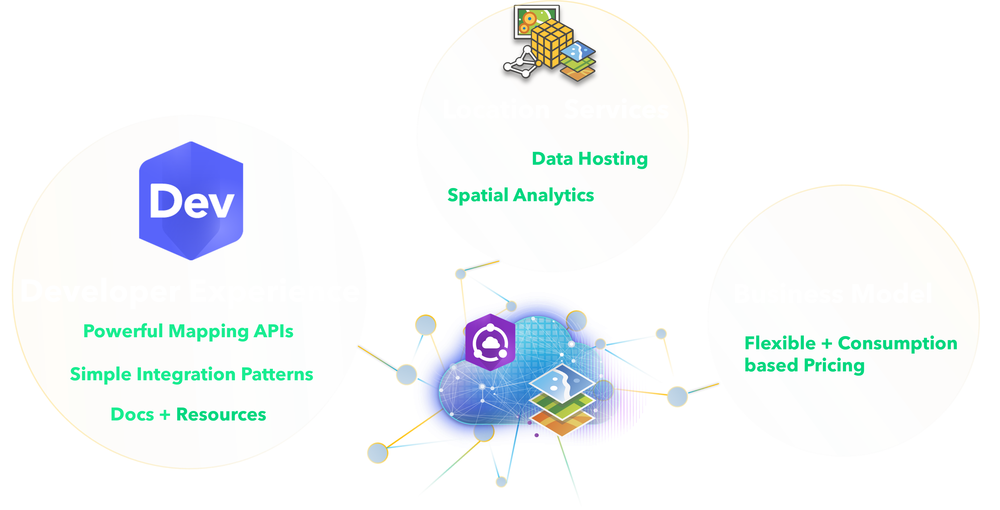

## Discovering what's available with ArcGIS Platform and JavaScript

[bit.ly/AC22DevJS](https://bit.ly/AC22DevJS)

<div class="name-title"> Jonny Dawe ⚡ Kristian Kaesinger  </div>

---

<!-- .slide: data-background-image="./assets/MainSlide.png"; .slide: data-background-size="cover" -->

## [ArcGIS Platform](https://www.esri.com/about/newsroom/arcnews/arcgis-platform-gives-developers-direct-access-to-location-services/)



---

<!-- .slide: data-background-image="./assets/MainSlide.png"; .slide: data-background-size="cover" -->

## [Simple JS Demo](https://github.com/Esri/cim-spec/blob/master/docs/v2/CIMSymbols.md#cimpointsymbol)

[`new CIMSymbol()`](https://developers.arcgis.com/javascript/latest/api-reference/esri-symbols-CIMSymbol.html#constructors-summary) - create custom multi-vector symbols

<div class="two-col">
  <div class="snippets full-height-blocks">
  
Simple Point CIM Symbol: 
    <div class="snippet">

```js [1|3-15|1-15]
const symbol = new CIMSymbol({
  data:{
    type: "CIMSymbolReference",
    symbol: {
       type: "CIMPointSymbol",
       symbolLayers: [{
          type: 'CIMVectorMarker',
          markerGraphics:[...
            // CIMTextSymbol
            // CIMMarkerSymbols
        ]
      }]
    }
  }
});
```

<svg data-play-frame="frame-cim-points" data-play-argument="simple" class="play-code" viewBox="0 0 24 24"><path fill="#999" d="M12,20.14C7.59,20.14 4,16.55 4,12.14C4,7.73 7.59,4.14 12,4.14C16.41,4.14 20,7.73 20,12.14C20,16.55 16.41,20.14 12,20.14M12,2.14A10,10 0 0,0 2,12.14A10,10 0 0,0 12,22.14A10,10 0 0,0 22,12.14C22,6.61 17.5,2.14 12,2.14M10,16.64L16,12.14L10,7.64V16.64Z" /></svg>

  </div>

Construct Attribute Driven Symbols:

<div class="snippet">

```js [1|1-5]
// Generate a Symbol based on the current available capacity of the carpark
function generateCapacitySymbol({ maxCapacity, availableCapacity }) {
    let fractionFilled = (maxCapacity - availableCapacity) / maxCapacity
    return new CIMSymbol({})
}
```

<svg data-play-frame="frame-cim-points" data-play-argument="complex" class="play-code" viewBox="0 0 24 24"><path fill="#999" d="M12,20.14C7.59,20.14 4,16.55 4,12.14C4,7.73 7.59,4.14 12,4.14C16.41,4.14 20,7.73 20,12.14C20,16.55 16.41,20.14 12,20.14M12,2.14A10,10 0 0,0 2,12.14A10,10 0 0,0 12,22.14A10,10 0 0,0 22,12.14C22,6.61 17.5,2.14 12,2.14M10,16.64L16,12.14L10,7.64V16.64Z" /></svg>

  </div>
</div>
  <div class="snippet-preview">
    <iframe id="frame-cim-points" data-src="./snippet.html?cim-points"></iframe>
  </div>
</div>

---

<!-- .slide: data-background-image="./assets/EndSlide.png"; .slide: data-background-size="cover" -->
